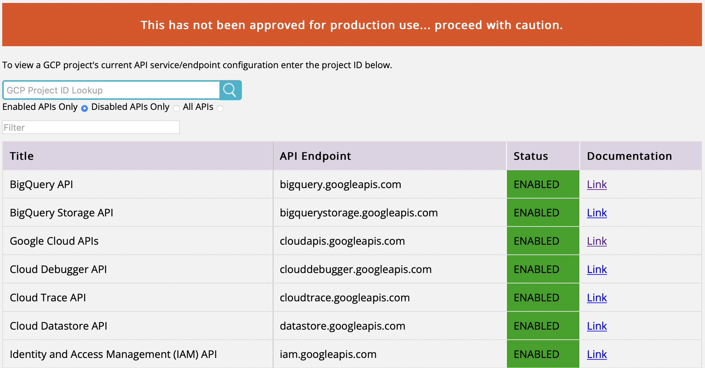

# GCP Service Observer

This is an application that displays GCP Service/API endpoint information for a given project. GCP requires API endpoints to be enabled per project before they can be leveraged so knowing which ones are enabled or disabled is an important first step in programmatically using client libraries or RESTFUL APIs.  

__The GCP Service Observer application is a personal project and not recommended for production or enterprise environments.__

## Table of Concents
- [Features](#features)
- [Configuration](#configuration)
  - [Steps](#steps)
- [Deployment](#deployment)
  - [Cloud Deployment](#cloud-deployment)
  - [Local Deployment](#local-deployment)
- [Contributing](#contributing)

## Features

- Project ID permissions checks
- Input sanitation and validation
- Can return all enabled, disabled, or both APIs for a given project
- Table filtering
- Direct-documentation links to enable or disable APIs manually
- Deploy locally for easy debugging
- Low cost - runs via Cloud Run




## Configuration

This application is designed to be deployed in a single project but the service account backing Cloud Run would have an IAM binding on the organization node. This configuration allows you to view any project's API/service endpoint status in the GCP organization. 

Before configuring for org-wide observability I would highly recommend adding some type of end user authentication. Google provides a nice turorial [here](https://cloud.google.com/run/docs/tutorials/identity-platform).

___The below steps are only required if you want to deploy to Cloud Run. If you want to deploy locally jump to [Local Deployment](#Local-Deployment).___

### Steps

Assuming you just want to demo the application in Cloud Run the only configuration needed is to add a value for the `project_id` variable in the [variables.tf](./terraform/variables.tf) file:

```bash
variable "project_id" {
  description = "The project ID where the service is deployed."
  default     = "demo-project-id" # add this line
}
```

If you want to deploy with observability across an entire organization you will need to add the above `project_id` variable and the below updates:

1. Uncomment the `variable "org_id"` block in the [variables.tf](./terraform/variables.tf) file and add a default value:

```bash
# Uncomment if using on org-level
#variable "org_id" {
#  description = "The organization ID where the service observer app has API/service view access."
#}
```

would become:

```bash
variable "org_id" {
  description = "The organization ID where the service observer app has API/service view access."
  default     = "my-org-id" # add this line
}
```

2. In the [main.tf](./terraform/main.tf) file uncomment the organization specific resources:

```bash
# Enable below for org-level project API / service listing
#resource "google_organization_iam_member" "organization-sa-iam" {
#  org_id  = var.org_id
#  role    = google_organization_iam_custom_role.organization-sa-custom-role.id
#  member = "serviceAccount:${google_service_account.service-observer-sa.email}"
#}

#resource "google_organization_iam_custom_role" "organization-sa-custom-role" {
#  role_id     = "ServiceObserverViewerRole"
#  org_id      = var.org_id
#  title       = "Service Observer org IAM role. View only."
#  description = "Provides permissions to view API/services across the organization."
#  permissions = ["resourcemanager.projects.get", "servicemanagement.services.list"]
#}
```

would become:

```bash
resource "google_organization_iam_member" "organization-sa-iam" {
  org_id  = var.org_id
  role    = google_organization_iam_custom_role.organization-sa-custom-role.id
  member = "serviceAccount:${google_service_account.service-observer-sa.email}"
}

resource "google_organization_iam_custom_role" "organization-sa-custom-role" {
  role_id     = "ServiceObserverViewerRole"
  org_id      = var.org_id
  title       = "Service Observer org IAM role. View only."
  description = "Provides permissions to view API/services across the organization."
  permissions = ["resourcemanager.projects.get", "servicemanagement.services.list"]
}
```

3. Lastly comment out the project-level IAM resources:

```bash
# Disable below if using for org-wide API/service listing
resource "google_project_iam_member" "project-sa-iam" {
  project = var.project_id
  role    = google_project_iam_custom_role.project-sa-custom-role.id
  member  = "serviceAccount:${google_service_account.service-observer-sa.email}"
}

resource "google_project_iam_custom_role" "project-sa-custom-role" {
  project     = var.project_id
  role_id     = "ServiceObserverViewerRole"
  title       = "Service Observer project IAM role. View only."
  description = "Provides permissions to view API/services on a given project."
  permissions = ["resourcemanager.projects.get", "servicemanagement.services.list"]
}
```

would become:

```bash
# Disable below if using for org-wide API/service listing
#resource "google_project_iam_member" "project-sa-iam" {
#  project = var.project_id
#  role    = google_project_iam_custom_role.project-sa-custom-role.id
#  member  = "serviceAccount:${google_service_account.service-observer-sa.email}"
#}

#resource "google_project_iam_custom_role" "project-sa-custom-role" {
#  project     = var.project_id
#  role_id     = "ServiceObserverViewerRole"
#  title       = "Service Observer project IAM role. View only."
#  description = "Provides permissions to view API/services on a given project."
#  permissions = ["resourcemanager.projects.get", "servicemanagement.services.list"]
#}
```

## Deployment

This application runs via [Cloud Run](https://cloud.google.com/run/docs/overview/what-is-cloud-run) and is deployed via Terraform or can be run locally. Please review the [Configuration](#Configuration) section before deploying.

In order to deploy to GCP you'll need administrator permissions for Cloud Run and the ability to enable/disable APIs and create IAM resources. 

### Cloud Deployment

_Before deploying authenticate locally via `gcloud auth login --update-adc`_

1. To deploy first change directories into the [terraform](./terraform) folder and execute `terraform init` 

```bash
# Change directory
  cd terraform/

# initialize terraform
  terraform init
```

- You should see a message stating `Terraform has been successfully initialized!`

2. Next execute a `terraform plan -out tfplan.json` and then review the potential updates.

3. If you are satisfied with the updates deploy the terraform via `terraform apply tfplan.json`

4. After the terraform is deployed you will see an output at the very end of the deployment that will look similar to
```bash
Outputs:

sa_id = "service-observer-sa@gcp-service-observer.iam.gserviceaccount.com"
```

5. Export the service account ID and the project ID you used for the Terraform `project_id` variable:

```bash
export SA_ID="service-observer-sa@gcp-service-observer.iam.gserviceaccount.com"
export PROJ_ID="demo-project-id"
```

6. Now that the infrastructure is mostly deployed we can deploy to Cloud Run via:

```bash
# Remember to change directories to the root of the repo
cd ../

# Deploy Cloud Run
gcloud beta run deploy gcpserviceobserver --source "." \
    --region="us-east1" \
    --service-account=$SA_ID \
    --allow-unauthenticated \
    --project=$PROJ_ID
```

7. GCP will perform all of the configuration needed for Cloud Run and once completed will provides a URL to access the application. Your output will look similar to below (if nothing went wrong):

```bash
Building using Dockerfile and deploying container to Cloud Run service [gcpserviceobserver] in project [gcp-service-observer] region [us-east1]
✓ Building and deploying new service... Done.
  ✓ Uploading sources...
  ✓ Building Container... Logs are available at [https://console.cloud.google.com/cloud-build/builds/2730
  3291-f10b-4f13-978f-74b941787060?project=285094994588].
  ✓ Creating Revision...
  ✓ Routing traffic...
  ✓ Setting IAM Policy...
Done.
Service [gcpserviceobserver] revision [gcpserviceobserver-00001-mif] has been deployed and is serving 100 percent of traffic.
Service URL: https://gcpserviceobserver-hda7rvdo7a-ue.a.run.app
```

8. Clicking the `Service URL` value will launch the GCP Service Observer application.

### Local Deployment

1. To deploy locally you will first need to export the Flask environment url:
```bash
export FLASK_APP=main
```

2. Next run Flask:
```bash
flask run
```

3. Enter the local URL in your browser window `http://127.0.0.1:5000`

## Contributing

Contributions are always welcome! This is a personal project but of course feel free to fork and have fun with it! 

Comments / concerns / bug info? Message me on Twitter [@jasonadyke](https://twitter.com/jasonadyke) or [LinkedIn](https://www.linkedin.com/in/jason-dyke-a1334a46/).


